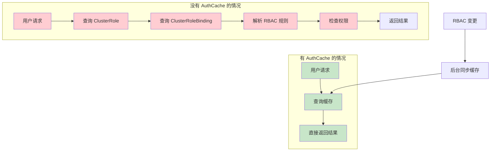
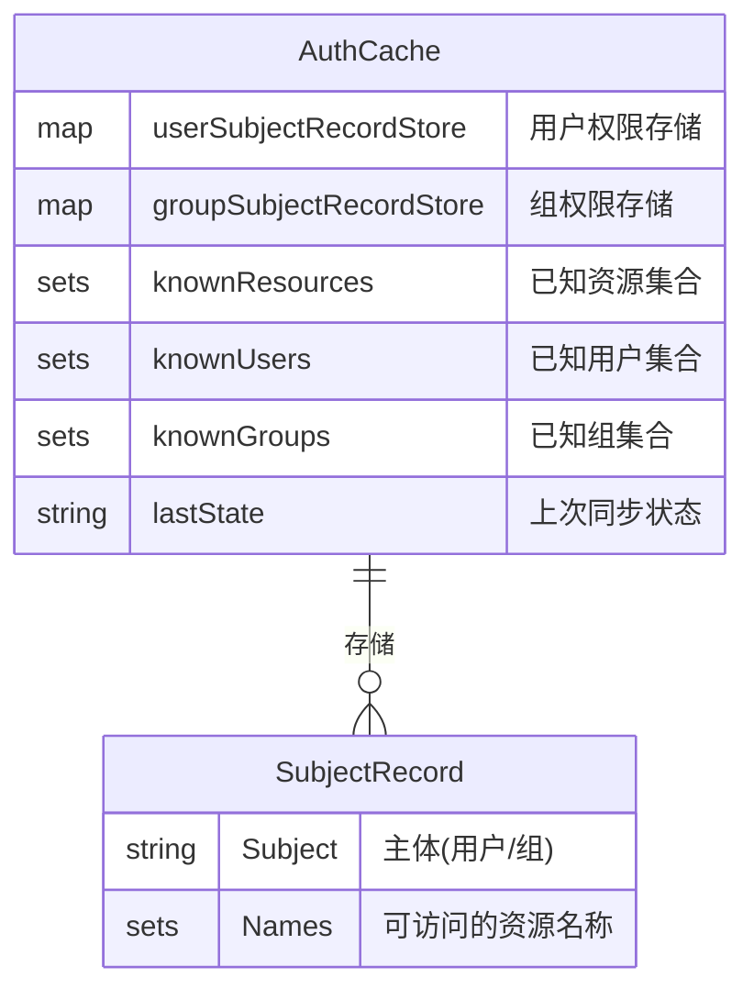
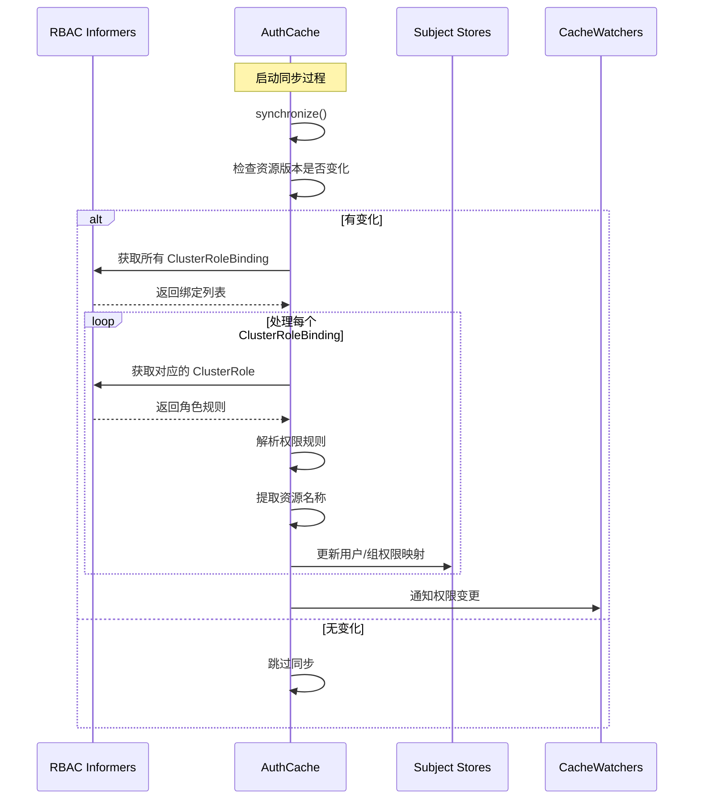
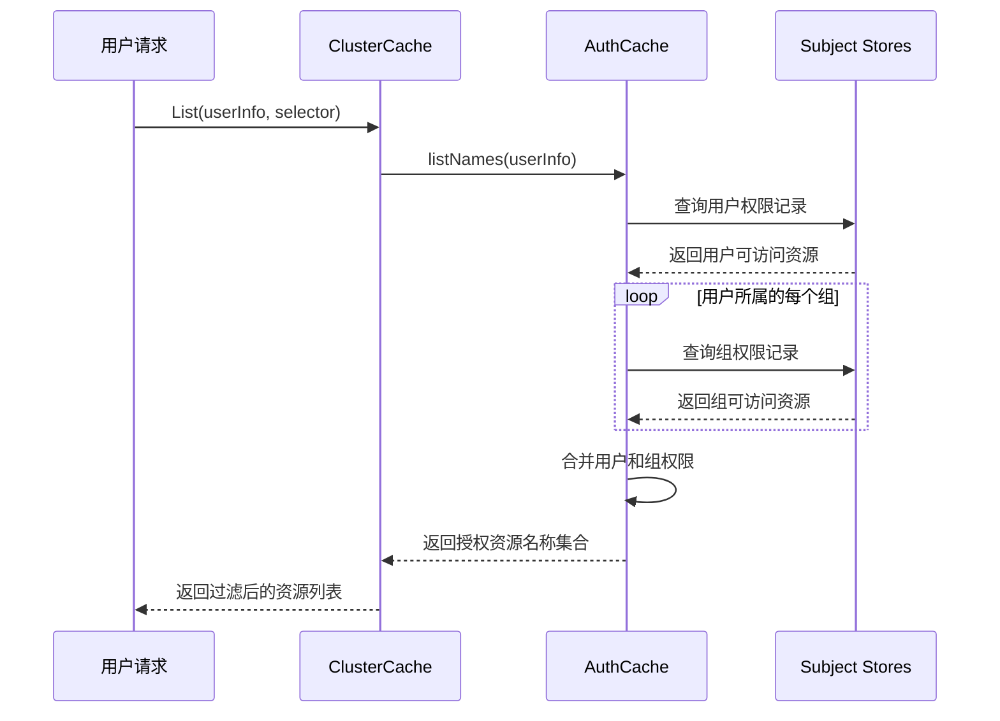
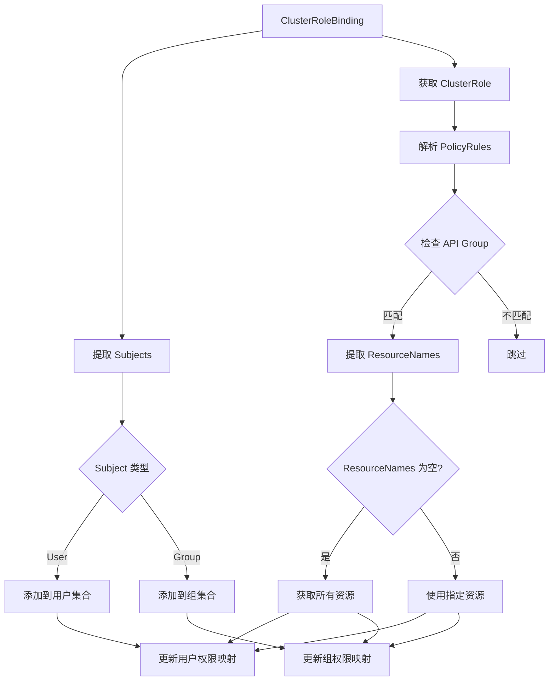
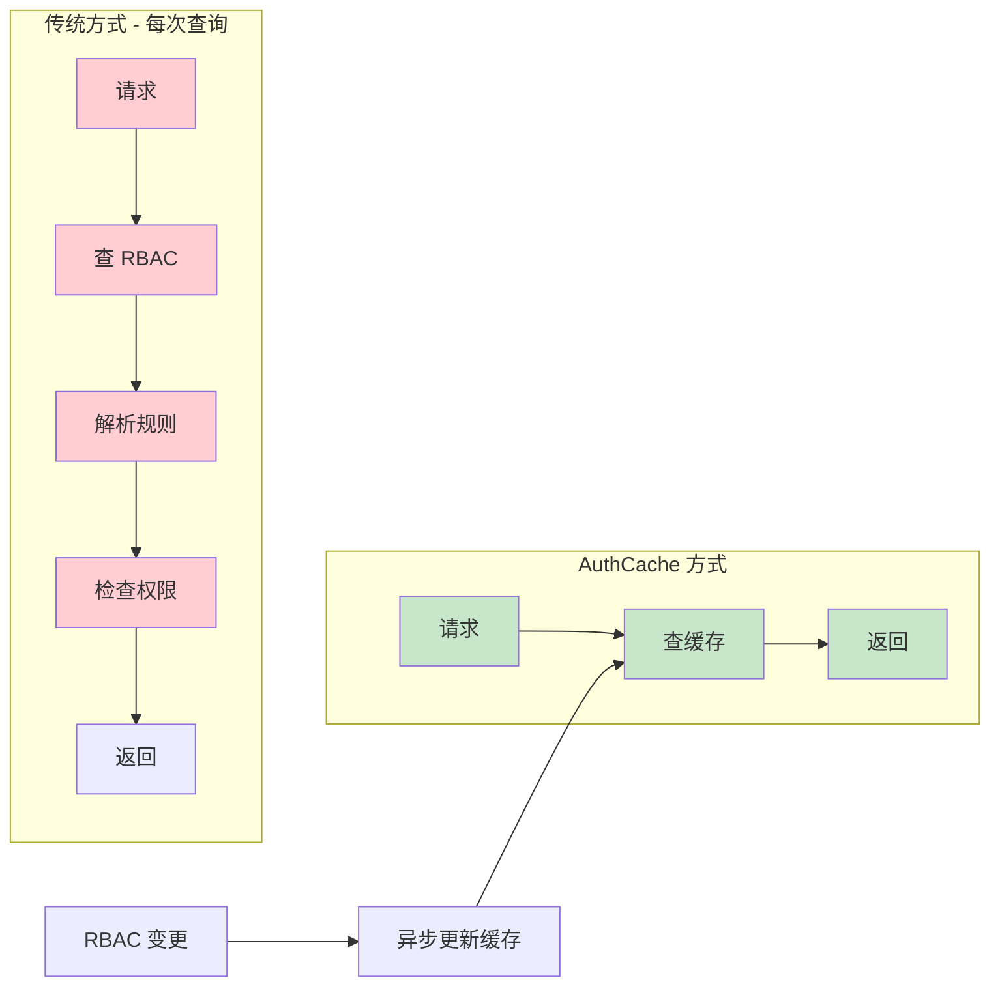
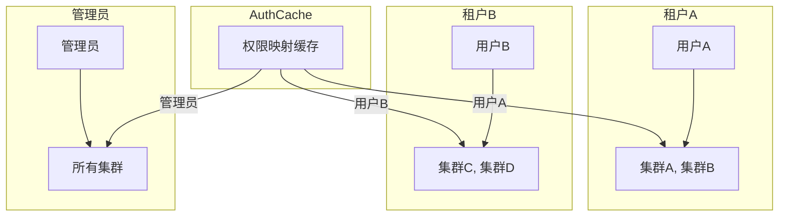
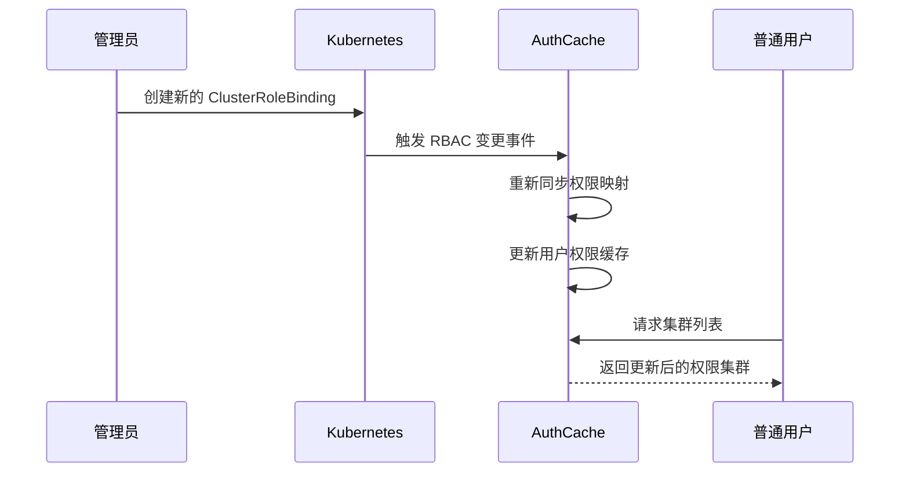

我来详细解释 `AuthCache` 的具体作用和工作原理。

## AuthCache 的核心作用

`AuthCache` 是一个**权限映射缓存系统**，它的主要目的是将 Kubernetes RBAC 规则转换为高效的用户-资源访问映射表。

## 1. AuthCache 解决的问题



## 2. AuthCache 的数据结构



## 3. AuthCache 的工作流程

### 初始化和同步过程：



### 权限查询过程：



## 4. AuthCache 的具体实现逻辑

### 权限解析过程：



### 核心代码逻辑解析：

```go
// AuthCache 的核心方法
func (ac *AuthCache) listNames(userInfo user.Info) sets.String {
    keys := sets.String{}
    user := userInfo.GetName()
    groups := userInfo.GetGroups()

    // 1. 查询用户直接权限
    obj, exists, _ := ac.userSubjectRecordStore.GetByKey(user)
    if exists {
        SubjectRecord := obj.(*SubjectRecord)
        keys.Insert(SubjectRecord.Names.List()...)
    }

    // 2. 查询用户组权限
    for _, group := range groups {
        obj, exists, _ := ac.groupSubjectRecordStore.GetByKey(group)
        if exists {
            SubjectRecord := obj.(*SubjectRecord)
            keys.Insert(SubjectRecord.Names.List()...)
        }
    }

    return keys // 返回用户可访问的所有资源名称
}
```

## 5. AuthCache 的优势

### 性能对比：



## 6. AuthCache 的实际应用场景

### 场景 1：多租户集群访问控制



### 场景 2：动态权限更新



## 总结

**AuthCache 的核心价值：**

1. **性能优化**：将复杂的 RBAC 规则解析转换为简单的 O(1) 查找
2. **权限隔离**：确保用户只能看到被授权的资源
3. **实时更新**：RBAC 规则变更能及时反映到缓存中
4. **内存效率**：使用高效的数据结构存储权限映射
5. **并发安全**：支持多个用户同时查询权限

**简单来说，AuthCache 就是一个"权限查找表"**，它预先计算好了每个用户/组可以访问哪些资源，避免了每次请求都要重新解析复杂的 RBAC 规则，大大提升了系统性能。
