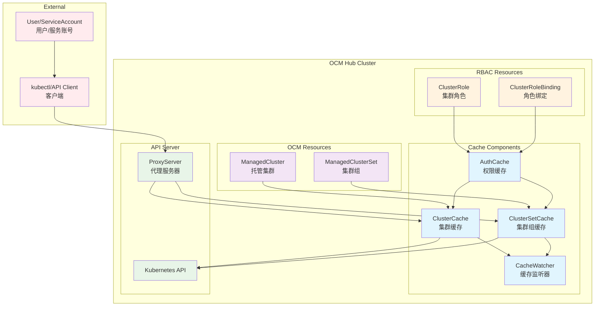
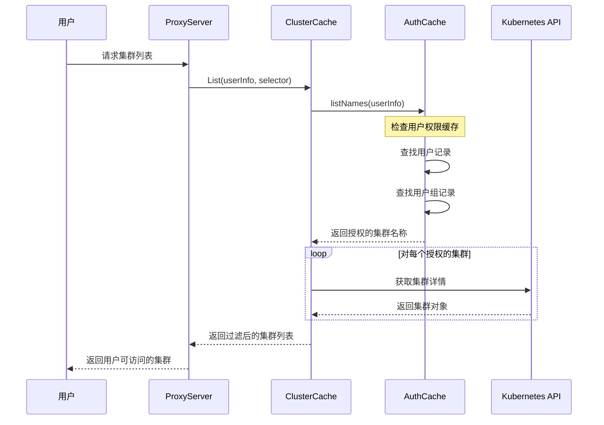
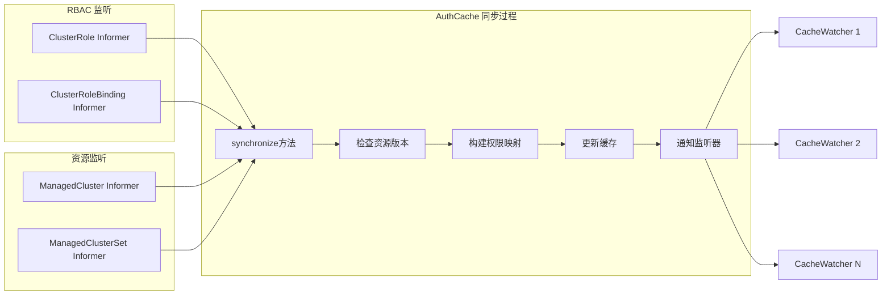
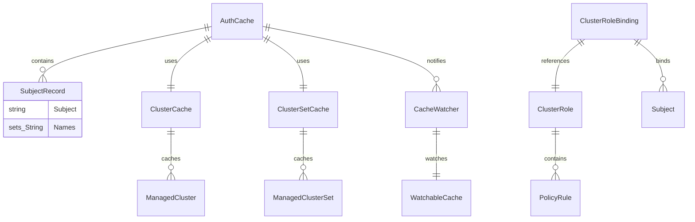
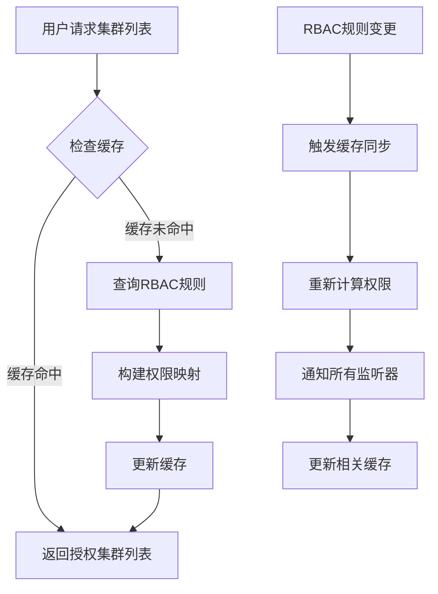

我来用Mermaid图来解释这个cache组件的作用和工作原理。

## 1. 整体架构图

## 2. 权限检查流程图

## 3. 缓存同步机制

## 4. 数据结构关系图

## 5. 核心功能说明

### 这个cache组件的主要作用：

1. **权限控制缓存**
   - 缓存用户和组对OCM资源的访问权限
   - 避免每次请求都查询RBAC规则
   - 提供高性能的权限检查

2. **资源访问过滤**
   - 根据用户权限过滤可访问的集群
   - 支持细粒度的资源级别权限控制
   - 实现多租户隔离

3. **实时更新机制**
   - 监听RBAC规则变化
   - 监听资源变化
   - 通过CacheWatcher实现实时通知

4. **性能优化**
   - 减少对Kubernetes API的直接调用
   - 提供本地缓存加速访问
   - 支持批量操作

### 具体使用场景：

这个cache组件本质上是一个**基于RBAC的资源访问控制缓存系统**，它的核心价值在于：

- **安全性**：确保用户只能访问被授权的资源
- **性能**：通过缓存避免频繁的权限检查
- **实时性**：权限变更能够及时反映到缓存中
- **扩展性**：支持多种OCM资源类型的权限控制
