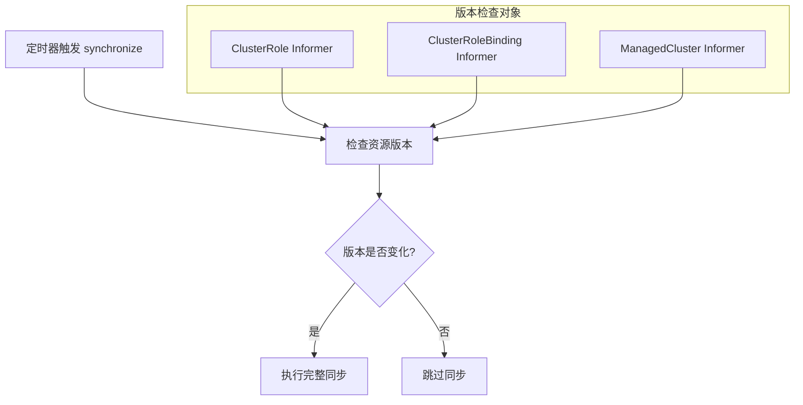
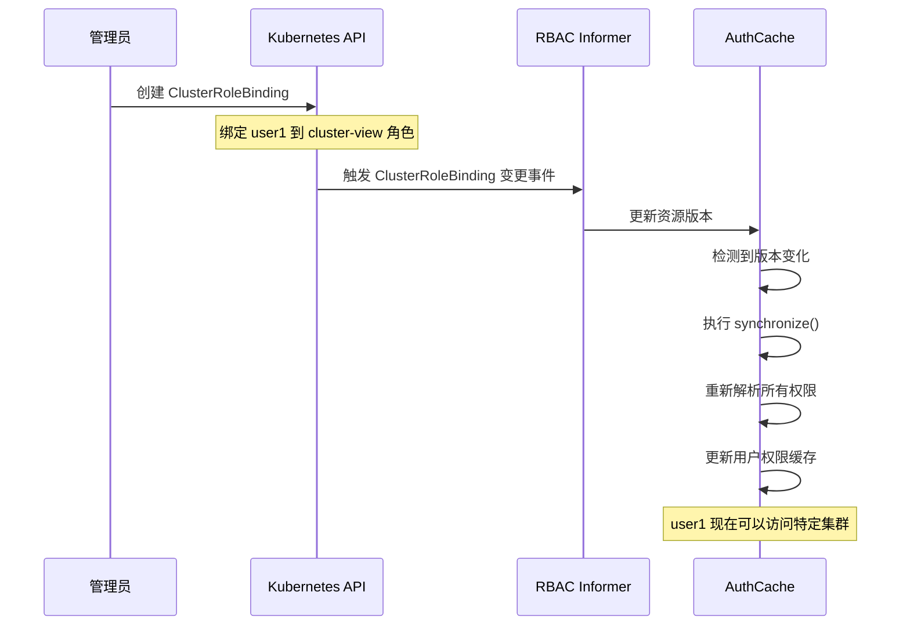

我来根据代码分析具体哪些 RBAC 变更会触发 AuthCache 更新。

Ran tool

Read file: pkg/cache/subjectrecord.go

Search files...
根据代码分析，我来详细说明哪些 RBAC 变更会触发 AuthCache 更新：

## RBAC 变更触发缓存更新的具体机制

### 1. 触发条件检测机制



### 2. 具体的 RBAC 变更类型

根据代码分析，以下 RBAC 变更会触发缓存更新：

#### **ClusterRole 变更**

```go
// 代码位置：pkg/cache/subjectrecord.go:159-177
func (ac *AuthCache) synchronize() {
    // 检查 ClusterRole 和 ClusterRoleBinding 的资源版本
    skip, currentState := ac.skip.SkipSynchronize(ac.lastState,
        ac.lastSyncResourceVersioner,
        ac.policyLastSyncResourceVersioner)
    if skip {
        return
    }
    // 执行同步...
}
```

**具体触发的 ClusterRole 变更：**

1. **创建新的 ClusterRole**

   ```yaml
   apiVersion: rbac.authorization.k8s.io/v1
   kind: ClusterRole
   metadata:
     name: open-cluster-management:view:cluster1
   rules:
     - apiGroups: ["cluster.open-cluster-management.io"]
       resources: ["managedclusters"]
       resourceNames: ["cluster1"]
       verbs: ["get", "list", "watch"]
   ```

2. **修改 ClusterRole 的权限规则**

   ```yaml
   # 修改前：只能访问 cluster1
   rules:
   - apiGroups: ["cluster.open-cluster-management.io"]
     resources: ["managedclusters"]
     resourceNames: ["cluster1"]
     verbs: ["get"]

   # 修改后：可以访问 cluster1 和 cluster2
   rules:
   - apiGroups: ["cluster.open-cluster-management.io"]
     resources: ["managedclusters"]
     resourceNames: ["cluster1", "cluster2"]
     verbs: ["get"]
   ```

3. **删除 ClusterRole**

#### **ClusterRoleBinding 变更**

```go
// 代码位置：pkg/cache/subjectrecord.go:186-247
func (ac *AuthCache) synchronizeClusterRoleBindings(...) {
    roleBindings, err := ac.clusterRolebindingLister.List(labels.Everything())
    // 处理所有 ClusterRoleBinding...
    for _, roleBinding := range roleBindings {
        clusterRole, err := ac.clusterRoleLister.Get(roleBinding.RoleRef.Name)
        // 解析权限并更新缓存...
    }
}
```

**具体触发的 ClusterRoleBinding 变更：**

1. **创建新的 ClusterRoleBinding**

   ```yaml
   apiVersion: rbac.authorization.k8s.io/v1
   kind: ClusterRoleBinding
   metadata:
     name: user1-cluster-access
   subjects:
     - kind: User
       name: user1
       apiGroup: rbac.authorization.k8s.io
   roleRef:
     kind: ClusterRole
     name: open-cluster-management:view:cluster1
     apiGroup: rbac.authorization.k8s.io
   ```

2. **修改 ClusterRoleBinding 的主体**

   ```yaml
   # 修改前：只绑定 user1
   subjects:
   - kind: User
     name: user1

   # 修改后：绑定 user1 和 group1
   subjects:
   - kind: User
     name: user1
   - kind: Group
     name: group1
   ```

3. **修改 ClusterRoleBinding 的角色引用**

   ```yaml
   # 修改前：引用 view 角色
   roleRef:
     name: open-cluster-management:view:cluster1

   # 修改后：引用 admin 角色
   roleRef:
     name: open-cluster-management:admin:cluster1
   ```

4. **删除 ClusterRoleBinding**

### 3. 权限解析逻辑

```go
// 代码位置：pkg/utils/role.go:207-275
func GetViewResourceFromClusterRole(clusterRole *rbacv1.ClusterRole, group, resource string) (sets.String, bool) {
    names := sets.NewString()
    all := false
    for i := range clusterRole.Rules {
        rule := clusterRole.Rules[i]

        // 检查 API Group 匹配
        if !APIGroupMatches(&rule, group) {
            continue
        }

        // 检查动词权限 (get/list/watch/*)
        if !VerbMatches(&rule, "get") && !VerbMatches(&rule, "list") && !VerbMatches(&rule, "*") {
            continue
        }

        // 检查资源类型匹配
        if !ResourceMatches(&rule, resource, "") {
            continue
        }

        // 如果 ResourceNames 为空，表示有所有资源的权限
        if len(rule.ResourceNames) == 0 {
            all = true
            return names, all
        }

        // 否则添加具体的资源名称
        names.Insert(rule.ResourceNames...)
    }
    return names, all
}
```

### 4. 实际触发示例

#### **示例 1：用户权限变更**



#### **示例 2：角色权限扩展**

```yaml
# 原始 ClusterRole
apiVersion: rbac.authorization.k8s.io/v1
kind: ClusterRole
metadata:
  name: cluster-viewer
rules:
  - apiGroups: ["cluster.open-cluster-management.io"]
    resources: ["managedclusters"]
    resourceNames: ["cluster1"] # 只能访问 cluster1
    verbs: ["get", "list"]

---
# 修改后的 ClusterRole
apiVersion: rbac.authorization.k8s.io/v1
kind: ClusterRole
metadata:
  name: cluster-viewer
rules:
  - apiGroups: ["cluster.open-cluster-management.io"]
    resources: ["managedclusters"]
    resourceNames: ["cluster1", "cluster2", "cluster3"] # 可以访问多个集群
    verbs: ["get", "list"]
```

#### **示例 3：组权限变更**

```yaml
# 新增 ClusterRoleBinding
apiVersion: rbac.authorization.k8s.io/v1
kind: ClusterRoleBinding
metadata:
  name: dev-team-cluster-access
subjects:
  - kind: Group
    name: dev-team
    apiGroup: rbac.authorization.k8s.io
roleRef:
  kind: ClusterRole
  name: open-cluster-management:view:dev-clusters
  apiGroup: rbac.authorization.k8s.io
```

### 5. 缓存更新的影响

```go
// 代码位置：pkg/cache/subjectrecord.go:230-247
// 更新用户权限
for updatedUser, updatedResources := range userToResources {
    updateResourcesToSubject(userSubjectRecordStore, updatedUser, updatedResources)
    ac.notifyWatchers(updatedResources, sets.NewString(updatedUser), sets.NewString())
}

// 更新组权限
for updatedGroup, updatedResources := range groupToResources {
    updateResourcesToSubject(groupSubjectRecordStore, updatedGroup, updatedResources)
    ac.notifyWatchers(updatedResources, sets.NewString(), sets.NewString(updatedGroup))
}

// 删除不存在的用户/组
for deletedUser := range ac.knownUsers.Difference(newAllUsers) {
    deleteSubject(userSubjectRecordStore, deletedUser)
    ac.notifyWatchers(sets.NewString(), sets.NewString(deletedUser), sets.NewString())
}
```

## 总结

**触发 AuthCache 更新的 RBAC 变更包括：**

1. **ClusterRole 变更**：创建、修改、删除任何相关的 ClusterRole
2. **ClusterRoleBinding 变更**：创建、修改、删除任何 ClusterRoleBinding
3. **权限规则变更**：修改 ClusterRole 中的权限规则（APIGroups、Resources、ResourceNames、Verbs）
4. **主体绑定变更**：修改 ClusterRoleBinding 中的 subjects 或 roleRef

**检测机制**：通过比较 Informer 的 ResourceVersion 来检测变更，确保只在真正有变化时才执行昂贵的同步操作。

**更新频率**：默认每秒检查一次（通过定时器触发），但只有在检测到实际变更时才会执行完整的权限重新计算。
