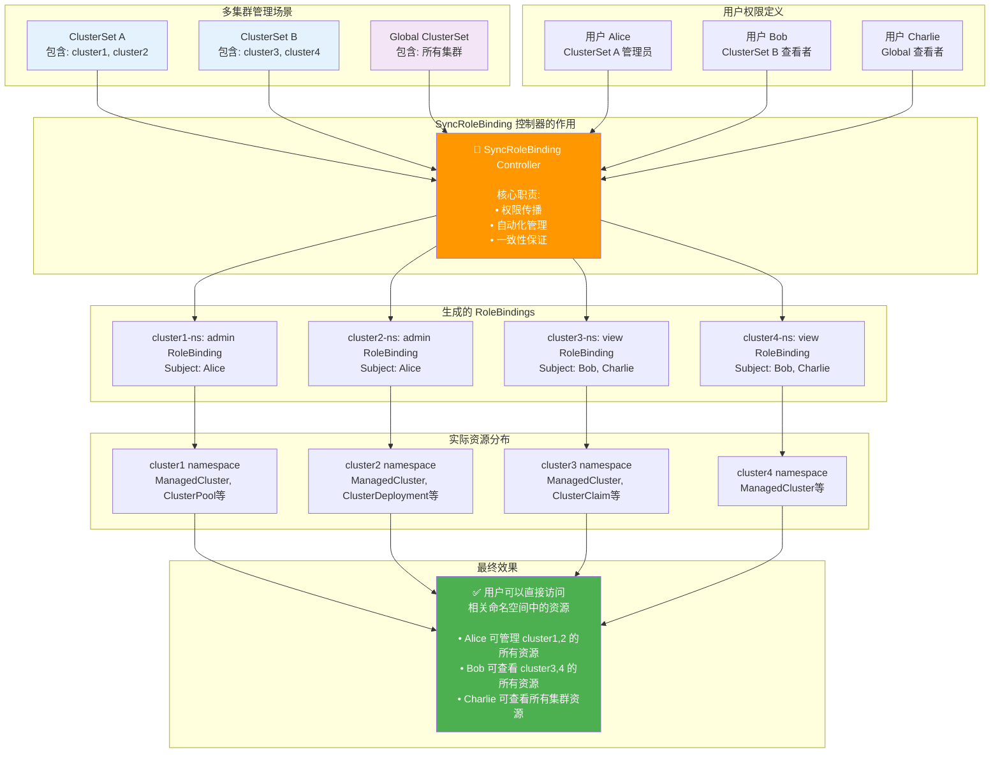

```mermaid
graph TB
    subgraph "多集群管理场景"
        CS1[ClusterSet A<br/>包含: cluster1, cluster2]
        CS2[ClusterSet B<br/>包含: cluster3, cluster4]
        GCS[Global ClusterSet<br/>包含: 所有集群]
    end

    subgraph "用户权限定义"
        U1[用户 Alice<br/>ClusterSet A 管理员]
        U2[用户 Bob<br/>ClusterSet B 查看者]
        U3[用户 Charlie<br/>Global 查看者]
    end

    subgraph "实际资源分布"
        NS1[cluster1 namespace<br/>ManagedCluster, ClusterPool等]
        NS2[cluster2 namespace<br/>ManagedCluster, ClusterDeployment等]
        NS3[cluster3 namespace<br/>ManagedCluster, ClusterClaim等]
        NS4[cluster4 namespace<br/>ManagedCluster等]
    end

    subgraph "SyncRoleBinding 控制器的作用"
        SYNC[🔄 SyncRoleBinding Controller<br/><br/>核心职责:<br/>• 权限传播<br/>• 自动化管理<br/>• 一致性保证]
    end

    subgraph "生成的 RoleBindings"
        RB1[cluster1-ns: admin RoleBinding<br/>Subject: Alice]
        RB2[cluster2-ns: admin RoleBinding<br/>Subject: Alice]
        RB3[cluster3-ns: view RoleBinding<br/>Subject: Bob, Charlie]
        RB4[cluster4-ns: view RoleBinding<br/>Subject: Bob, Charlie]
    end

    subgraph "最终效果"
        EFFECT[✅ 用户可以直接访问<br/>相关命名空间中的资源<br/><br/>• Alice 可管理 cluster1,2 的所有资源<br/>• Bob 可查看 cluster3,4 的所有资源<br/>• Charlie 可查看所有集群资源]
    end

    CS1 --> SYNC
    CS2 --> SYNC
    GCS --> SYNC
    U1 --> SYNC
    U2 --> SYNC
    U3 --> SYNC

    SYNC --> RB1
    SYNC --> RB2
    SYNC --> RB3
    SYNC --> RB4

    RB1 --> NS1
    RB2 --> NS2
    RB3 --> NS3
    RB4 --> NS4

    NS1 --> EFFECT
    NS2 --> EFFECT
    NS3 --> EFFECT
    NS4 --> EFFECT

    style SYNC fill:#ff9800,color:#fff
    style EFFECT fill:#4caf50,color:#fff
    style CS1 fill:#e3f2fd
    style CS2 fill:#e3f2fd
    style GCS fill:#f3e5f5
```
