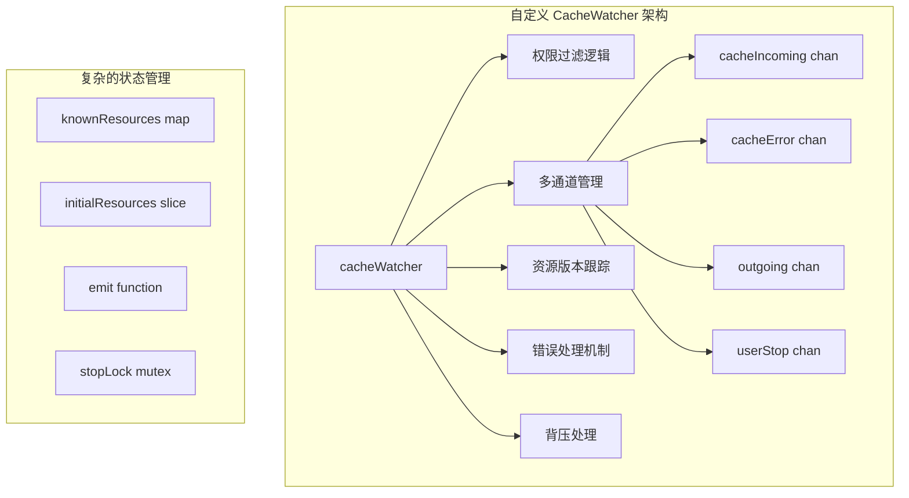

让我仔细分析一下当前实现的 watcher 机制，看看是否可以用官方包替代。

Read file: pkg/cache/watcher.go

Search files...

Ran tool
基于对代码的深入分析，我来回答你关于自定义 watcher 的问题：

## 当前 Watcher 的复杂性分析

### 1. 当前实现的复杂性



### 2. 自定义 Watcher 的必要性分析

**当前 watcher 解决的核心问题：**

1. **基于权限的事件过滤**

   ```go
   func (w *cacheWatcher) GroupMembershipChanged(names, users, groups sets.String) {
       // 只有当用户有权限时才处理事件
       hasAccess := users.Has(w.user.GetName()) || groups.HasAny(w.user.GetGroups()...)
       if !hasAccess {
           return
       }
       // 处理权限变更导致的资源可见性变化...
   }
   ```

2. **权限变更的实时响应**

   - 当 RBAC 规则变更时，需要动态调整用户可见的资源
   - 标准的 Kubernetes Informer 无法处理这种"虚拟"的资源变更

3. **多层事件转换**
   - RBAC 变更 → 权限缓存更新 → 用户可见资源变更 → Watch 事件

## 是否可以用官方包替代？

### 分析结论：**部分可以，但不能完全替代**

### 1. 可以替代的部分

#### **使用 `k8s.io/client-go/tools/watch` 简化基础设施**

```go
import (
    "k8s.io/client-go/tools/watch"
    "k8s.io/apimachinery/pkg/watch"
)

// 使用官方的 RetryWatcher 处理连接重试
type SimplifiedCacheWatcher struct {
    user        user.Info
    authCache   WatchableCache
    retryWatcher *watch.RetryWatcher
}

func NewSimplifiedCacheWatcher(user user.Info, authCache WatchableCache) *SimplifiedCacheWatcher {
    return &SimplifiedCacheWatcher{
        user:      user,
        authCache: authCache,
    }
}
```

#### **使用 `k8s.io/apimachinery/pkg/util/wait` 简化定时逻辑**

```go
import "k8s.io/apimachinery/pkg/util/wait"

// 替代复杂的channel管理
func (w *SimplifiedCacheWatcher) Start(ctx context.Context) {
    wait.UntilWithContext(ctx, w.processEvents, time.Second)
}
```

### 2. 无法替代的核心部分

#### **权限感知的事件过滤逻辑**

```go
// 这部分逻辑是业务特定的，无法用标准包替代
func (w *cacheWatcher) GroupMembershipChanged(names, users, groups sets.String) {
    // 检查用户权限
    hasAccess := users.Has(w.user.GetName()) || groups.HasAny(w.user.GetGroups()...)

    // 处理资源删除（权限被撤销）
    for name := range w.knownResources {
        if !names.Has(name) {
            // 生成 DELETE 事件
            w.cacheIncoming <- watch.Event{
                Type:   watch.Deleted,
                Object: w.authCache.ConvertResource(name),
            }
        }
    }

    // 处理资源添加/修改（权限被授予或资源更新）
    for _, name := range names.List() {
        // 生成 ADD/MODIFY 事件
        // ...
    }
}
```

## 改进建议：混合方案

### 1. 保留核心业务逻辑，简化基础设施

```go
// 使用官方包简化的版本
type ImprovedCacheWatcher struct {
    user      user.Info
    authCache WatchableCache

    // 使用官方的事件处理器
    eventHandler *watch.StreamWatcher

    // 简化的状态管理
    knownResources sync.Map // 替代 map + mutex

    // 使用 context 替代多个 channel
    ctx    context.Context
    cancel context.CancelFunc
}

func NewImprovedCacheWatcher(user user.Info, authCache WatchableCache) *ImprovedCacheWatcher {
    ctx, cancel := context.WithCancel(context.Background())

    return &ImprovedCacheWatcher{
        user:      user,
        authCache: authCache,
        ctx:       ctx,
        cancel:    cancel,
    }
}

// 实现标准的 watch.Interface
func (w *ImprovedCacheWatcher) ResultChan() <-chan watch.Event {
    return w.eventHandler.ResultChan()
}

func (w *ImprovedCacheWatcher) Stop() {
    w.cancel()
}
```

### 2. 使用事件总线模式

```go
// 使用更现代的事件驱动架构
type EventBus interface {
    Subscribe(eventType string, handler func(event interface{}))
    Publish(eventType string, event interface{})
}

type PermissionAwareWatcher struct {
    user     user.Info
    eventBus EventBus
    filter   PermissionFilter
}

func (w *PermissionAwareWatcher) Start() {
    // 订阅权限变更事件
    w.eventBus.Subscribe("permission.changed", w.handlePermissionChange)
    w.eventBus.Subscribe("resource.changed", w.handleResourceChange)
}
```

### 3. 使用 Controller-Runtime 的 Source 接口

```go
import "sigs.k8s.io/controller-runtime/pkg/source"

// 实现自定义的 Source
type PermissionAwareSource struct {
    user      user.Info
    authCache WatchableCache
}

func (s *PermissionAwareSource) Start(ctx context.Context, handler handler.EventHandler, queue workqueue.RateLimitingInterface) error {
    // 使用 controller-runtime 的基础设施
    // 但保留权限过滤逻辑
}
```

## 最终建议

### **保留自定义 Watcher，但进行现代化改造**

1. **保留必要的业务逻辑**：权限感知的事件过滤无法用标准包替代
2. **简化基础设施**：使用官方包处理连接管理、重试、错误处理
3. **改进架构**：使用更现代的模式（事件总线、context、sync.Map 等）

### **具体改进方案**

```go
// 现代化的实现
type ModernCacheWatcher struct {
    user      user.Info
    authCache WatchableCache

    // 使用官方包的优势
    retryWatcher *watch.RetryWatcher

    // 简化的状态管理
    knownResources *sync.Map

    // 使用 context 统一管理生命周期
    ctx    context.Context
    cancel context.CancelFunc

    // 使用 channel 但简化设计
    events chan watch.Event
}

func (w *ModernCacheWatcher) Watch() watch.Interface {
    // 结合官方包的稳定性和自定义的业务逻辑
    return watch.NewStreamWatcher(w.events)
}
```

**总结：自定义 Watcher 有其必要性，但可以通过使用官方包的基础组件来大幅简化实现，同时保留核心的权限感知逻辑。**
