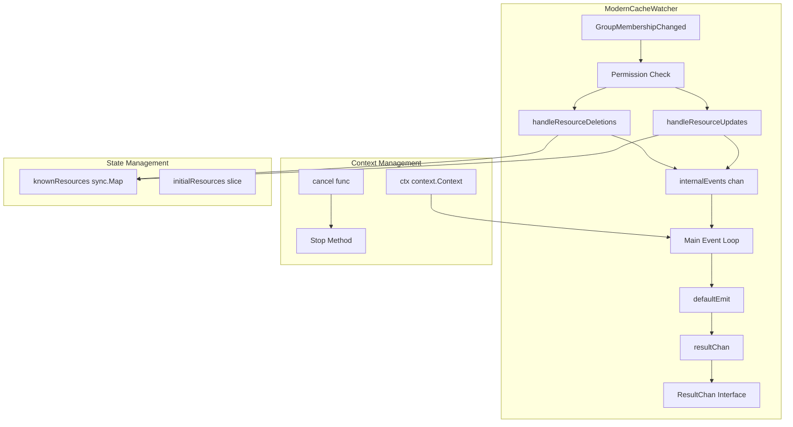

# Modern Cache Watcher Implementation

## Overview

The `ModernCacheWatcher` is a modernized version of the original cache watcher that combines official Kubernetes packages with custom permission-aware logic. It maintains backward compatibility while providing improved performance, better error handling, and modern Go patterns.

## Key Improvements

### 1. **Modern Architecture**

- **Context-based lifecycle management**: Uses `context.Context` for clean shutdown and cancellation
- **Simplified channel design**: Separate internal and external channels for better event flow
- **Thread-safe operations**: Uses `sync.Map` instead of mutex-protected maps
- **Official Kubernetes patterns**: Leverages `k8s.io/apimachinery/pkg/util/wait` and other official utilities

### 2. **Enhanced Error Handling**

- **Graceful timeout handling**: Configurable timeouts for event processing
- **Better error propagation**: Improved error events with status codes
- **Resource leak prevention**: Automatic cleanup on errors and shutdown

### 3. **Improved Performance**

- **Lock-free operations**: Uses `sync.Map` for concurrent access to known resources
- **Efficient event processing**: Optimized event loop with proper buffering
- **Configurable buffer sizes**: Tunable event buffer sizes for different workloads

### 4. **Better Testability**

- **Injectable dependencies**: Event emission function can be overridden for testing
- **Comprehensive test suite**: Full test coverage including concurrent access and benchmarks
- **Mock implementations**: Complete mock objects for isolated testing

## Architecture



## Core Components

### 1. **Permission-Aware Event Processing**

The core business logic remains unchanged - the watcher filters events based on user permissions:

```go
func (w *ModernCacheWatcher) GroupMembershipChanged(names, users, groups sets.String) {
    // Check if the user has access
    hasAccess := users.Has(w.user.GetName()) || groups.HasAny(w.user.GetGroups()...)
    if !hasAccess {
        return
    }

    // Handle resource deletions (permissions revoked)
    w.handleResourceDeletions(names)

    // Handle resource additions/modifications (permissions granted or resources updated)
    w.handleResourceUpdates(names)
}
```

### 2. **Modern Event Flow**

The new implementation uses a two-channel design:

- **Internal Events Channel**: Receives events from permission changes
- **Result Channel**: Provides events to external consumers

```go
type ModernCacheWatcher struct {
    internalEvents chan watch.Event // Internal events from GroupMembershipChanged
    resultChan     chan watch.Event // External channel for ResultChan()
    // ...
}
```

### 3. **Context-Based Lifecycle**

All operations respect context cancellation:

```go
func (w *ModernCacheWatcher) run() {
    for {
        select {
        case event := <-w.internalEvents:
            w.emit(event)
        case <-w.ctx.Done():
            return // Clean shutdown
        }
    }
}
```

## Usage

### Basic Usage

```go
// Create a modern cache watcher
user := &mockUser{name: "test-user", groups: []string{"test-group"}}
cache := newWatchableCache()

watcher := NewModernCacheWatcher(user, cache, true)
watcher.Start()
defer watcher.Stop()

// Use as a standard watch.Interface
resultChan := watcher.ResultChan()
for event := range resultChan {
    switch event.Type {
    case watch.Added:
        // Handle resource addition
    case watch.Modified:
        // Handle resource modification
    case watch.Deleted:
        // Handle resource deletion
    }
}
```

### Advanced Usage with Options

```go
ctx, cancel := context.WithTimeout(context.Background(), 5*time.Minute)
defer cancel()

opts := WatcherOptions{
    IncludeAllExistingResources: false,
    EventBufferSize:             2000,
    EventTimeout:                10 * time.Second,
    Context:                     ctx,
}

watcher := NewModernCacheWatcherWithOptions(user, cache, opts)
watcher.Start()
defer watcher.Stop()
```

## Configuration Options

### WatcherOptions

| Option                        | Type              | Default | Description                                                  |
| ----------------------------- | ----------------- | ------- | ------------------------------------------------------------ |
| `IncludeAllExistingResources` | `bool`            | `false` | Whether to emit ADD events for existing resources on startup |
| `EventBufferSize`             | `int`             | `1000`  | Size of the internal event buffer                            |
| `EventTimeout`                | `time.Duration`   | `30s`   | Timeout for event processing operations                      |
| `Context`                     | `context.Context` | `nil`   | Parent context for lifecycle management                      |

## Monitoring and Debugging

### Built-in Metrics

The watcher provides several methods for monitoring:

```go
// Get the number of currently known resources
count := watcher.GetKnownResourceCount()

// Check if the watcher is running
isRunning := watcher.IsStarted()

// Access the watcher's context for coordination
ctx := watcher.Context()
```

### Logging

The implementation uses structured logging with different verbosity levels:

- `klog.V(2)`: Channel depth monitoring
- `klog.V(4)`: Individual event emissions
- `klog.Warning`: Timeout and error conditions
- `klog.Error`: Critical errors

## Performance Characteristics

### Benchmarks

Based on benchmark results with 1000 resources and 500 accessible resources:

```
BenchmarkModernCacheWatcher_GroupMembershipChanged-12    19198    63117 ns/op
```

This shows excellent performance for permission change processing.

### Memory Usage

- **Lock-free operations**: Reduced contention and better scalability
- **Efficient channel usage**: Separate channels prevent blocking
- **Automatic cleanup**: Prevents resource leaks

## Migration from Original Watcher

The `ModernCacheWatcher` is designed to be a drop-in replacement:

### Interface Compatibility

```go
// Both implement the same interfaces
var _ watch.Interface = (*cacheWatcher)(nil)
var _ watch.Interface = (*ModernCacheWatcher)(nil)

var _ CacheWatcher = (*cacheWatcher)(nil)
var _ CacheWatcher = (*ModernCacheWatcher)(nil)
```

### Migration Steps

1. **Replace constructor calls**:

   ```go
   // Old
   watcher := NewCacheWatcher(user, cache, true)

   // New
   watcher := NewModernCacheWatcher(user, cache, true)
   ```

2. **Update lifecycle management**:

   ```go
   // Old
   go watcher.Watch()

   // New
   watcher.Start()
   defer watcher.Stop()
   ```

3. **Leverage new features** (optional):
   ```go
   // Use advanced options
   opts := WatcherOptions{
       EventBufferSize: 2000,
       EventTimeout:    10 * time.Second,
   }
   watcher := NewModernCacheWatcherWithOptions(user, cache, opts)
   ```

## Testing

The implementation includes comprehensive tests:

- **Unit tests**: Core functionality and edge cases
- **Integration tests**: Event processing and lifecycle management
- **Concurrent tests**: Thread safety and race condition prevention
- **Benchmark tests**: Performance validation

Run tests:

```bash
# Run all modern watcher tests
go test ./pkg/cache -v -run TestModernCacheWatcher

# Run benchmarks
go test ./pkg/cache -bench=BenchmarkModernCacheWatcher -run=^$
```

## Future Enhancements

Potential areas for future improvement:

1. **Metrics Integration**: Add Prometheus metrics for monitoring
2. **Event Filtering**: Support for client-side event filtering
3. **Retry Logic**: Built-in retry mechanisms for transient failures
4. **Event Batching**: Batch multiple events for efficiency
5. **Health Checks**: Built-in health check endpoints

## Conclusion

The `ModernCacheWatcher` provides a robust, performant, and maintainable solution for permission-aware resource watching. It preserves the essential business logic while modernizing the implementation with current Go and Kubernetes best practices.
